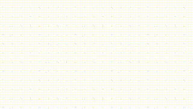

# Crabs.js
Crabs.js is an open-source set of particles including **fishes, cars, and ghosts**. Feel free to use them or make your own.

## How to use
1. Add `<link href="crabs.css" rel="stylesheet">` and `` to the head of your webpage.
2. In the body, add one of the HTML elements listed below. *(see "Types of Particles")*
3. Finally, call the function associated with the element to summon it.

## Functions
Call these functions to summon the associated elements. **These will only work if the original element(s) are present in your document.**
- `addFish()`: Adds a random fish.
- `addCar()`: Adds a random vehicle.
- `addGhost()`: Adds a ghost.

There are also functions that summon specific elements rather than being random. For fishes, use the functions `Fish1()`-`Fish3()` and for vehicles, use `Car1()`-`Car6()`.

## Types of Particles
Below are all of the types of particles. Paste the ones you want into your website

    `🐟`
    `🐠`
    `🐡`
    
    `🚗`
    `🚙`
    `🛻`
    `🚌`
    `🚚`
    `🚓`

    `👻`
